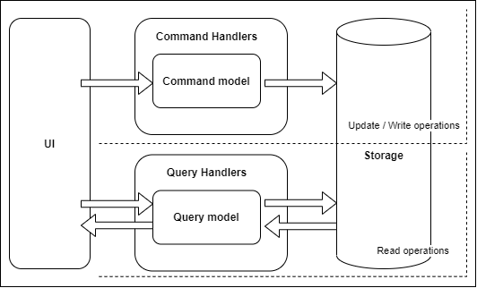
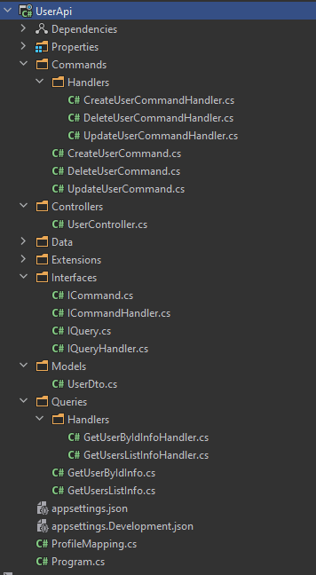
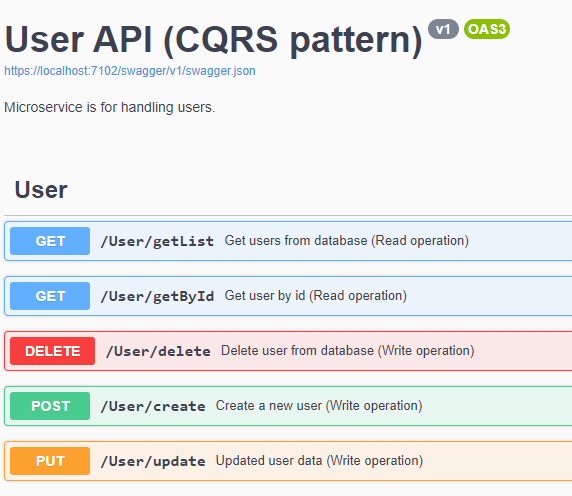

## Overview

**CQRS** stands for `Command and Query Responsibility Segregation`, an architectural pattern for software development. 
The core idea of this pattern is to separate **Read** and **Update** operations by using different models to handle the treatment. 
We use **Commands** to update data, and **Queries** to read data.

if you are used to create HTTP web API, here is the translation:
- `Commands` = POST/PUT/DELETE methods
- `Queries` = GET methods

## Description

The image below illustrates a basic implementation of the CQRS Pattern:



__Command = Instruction__. A command is an instruction, a directive to perform a specific task. It is an intention to change something.
Commands represent the intention of changing the state of an entity. They execute operations like `Insert`, `Update`, `Delete`.
The commands are interpreted by the `CommandHandlers` and they return an event, which can be a successful event or a failure event. If the command succeeds it will create a successful event, and if the command fails it will create a failure event. 
For example:
```csharp
public sealed class CreateUserCommand: ICommand
{
    public CreateUserCommand(UserDto newUser)
    {
        Entity = newUser;
    }

    public UserDto Entity { get; }
}
```

__Query = Request for info__. A query is a request for information. t is an intention to get data, or the status of data, from a specific place. Nothing in the data should be changed by the request. As queries do not change anything.
Queries will only contain the methods for getting data. They are used to read the data in the database to return the DTOs to the client, which will be displayed in the user interface.

Queries usually start with the word `Get`, because queries ask for the application to provide some data, for example:
```csharp
public class GetUserByIdInfo: IQuery
{
    public GetUserByIdInfo(int userId)
    {
        UserId = userId;
    }
    public int UserId { get; }
}
```

## Pros of the pattern 
- **Separation of Concern**. We have separate models for read and write operations which not only gives us flexibility but also keeps our models simple and easy to maintain. Normally, the write models have most of the complex business logic whereas the read models are normally simple.
- **Better scalability**. The reads operations often occur way more than writes so keeping queries separate than commands makes our applications highly scalable. Both read and write models can be scaled independently even by two different developers or teams without any fear of breaking anything.
- **Better performance**. We can use a separate database or a fast cache e.g. Redis for read operations which can improve application performance significantly.
- **Optimized Data Models**. The read models can use a schema or pre-calculated data sources that are optimized for queries. Similarly, the write models can use a schema that is optimized for data updates.
- **Clear boundaries between the system behaviour**. Tt provides specific guidance on structuring the application in relation to behaviour.
- **Closer to business logic**. The code and architecture are segregated by their business operations, making it easier to focus on the business case.
- **Logging queries and commands**.
- **Improved security**.
- **Easier scaling, optimisations and architectural changes**. As our code is kept in silos, it's easier to fine-tune only one pipeline, leaving the rest untouched. It's easier to focus on the precise optimisations in the places that are business-critical.

## Cons of the pattern
- **Added complexity**. The basic idea of CQRS is simple but in bigger systems sometimes it increases the complexity especially in scenarios where read operations also need to update data at the same time.
- **Eventual consistency**. If we use a separate database for read and a separate database for write then synchronizing the read data become a challenge. We have to make sure we are not reading the stale data.
- **Message failures or duplicate messages** If using messaging to process commands and publish update events, the application must handle message failures or duplicate messages.

## When the pattern can be used?
- Has **a high demand for data consumption** (high volumes of reads and writes), or require the ability to scale the read and write paths separately.
- **Performance of data reads** must be tuned separately from the **performance of data writes**, especially when the number of reads is much greater than the number of writes.
- There is **the need for one team to focus on the complex domain model** that is part of the write model, while another team can focus on the read model and the user interfaces.
- **Integration with other systems, especially in combination with event sourcing**, where the temporal failure of one subsystem shouldn’t affect the availability of the others.

> Despite these benefits, **you should be very cautious about using CQRS**. Many information systems fit well with the notion of an information base that is updated in the same way that it's read, adding CQRS to such a system can add significant complexity. I've certainly seen cases where it's made a significant drag on productivity, adding an unwarranted amount of risk to the project, even in the hands of a capa

## When the pattern can not be used?
- **The domain or the business rules are simple**.
- A **simple CRUD-style user interface** and data access operations are sufficient.

## Code sample
In this example, we will create a user api using .NET Core and an In-Memory database. Here is the solution structure:



To manage queries operations, I’m using the following interfaces:
```csharp
/// <summary>
/// Used to mark query class (Read)
/// </summary>
public interface IQuery
{}
/// <summary>
/// Used to mark query handler (process query) (Read operation)
/// </summary>
public interface IQueryHandler
{}

/// <summary>
/// Generic class to implement query handler (Read operation)
/// </summary>
/// <typeparam name="T"></typeparam>
/// <typeparam name="TR"></typeparam>
public interface IQueryHandler<in T, TR> : IQueryHandler where T : IQuery
{
    Task<TR> HandleAsync(T query);
}
```
To manage commands operations, I’m using the following interfaces:
```csharp
/// <summary>
/// Used to mark command class (Write)
/// </summary>
public interface ICommand
{}
/// <summary>
/// Used to mark command handler (Write operation)
/// </summary>
public interface ICommandHandler
{}
/// <summary>
/// Generic class to implement command handler (Write operation)
/// </summary>
/// <typeparam name="T"></typeparam>
public interface ICommandHandler<in T> : ICommandHandler where T : ICommand
{   
    Task HandleAsync(T command);
}
```

### Commands

Now, let’s try to explain one use case of the application, for example:

**"Create a new user"**: this scenario is a command operation because it will make a change to the system.
First, I created a class called ``CreateUserCommand``, this class is a simple DTO object that implement ``ICommand``:
```csharp
public sealed class CreateUserCommand: ICommand
{
    public CreateUserCommand(UserDto newUser)
    {
        Entity = newUser;
    }

    public UserDto Entity { get; }
}
```
Secondly, I created a class called ``CreateUserCommandHandler`` that implement ``ICommandHandler<T>`` and used ``CreateUserCommand`` as input parameter to perform the user scenario.
```csharp
public sealed class CreateUserCommandHandler: ICommandHandler<CreateUserCommand>
{
    private readonly AppContextInMemoryDb _dbContext;
    private readonly IMapper _mapper;

    public CreateUserCommandHandler(AppContextInMemoryDb dbContext, IMapper mapper)
    {
        _dbContext = dbContext;
        _mapper = mapper;
    }

    public async Task HandleAsync(CreateUserCommand command)
    {
        var user = _mapper.Map<User>(command.Entity);
        _dbContext.Users.Add(user);
        await _dbContext.SaveChangesAsync();
    }
}
```
Thirdly, the handler is injected using ``Microsoft.Extensions.DependencyInjection`` in the controller ``UserController``:
```csharp
private readonly IQueryHandler<GetUserByIdInfo, UserDto> _getUserByIdInfoHandler;
private readonly ICommandHandler<CreateUserCommand> _createUserCommandHandler;
public UserController(
    IQueryHandler<GetUserByIdInfo, UserDto> getUserByIdInfoHandler,
    ICommandHandler<CreateUserCommand> createUserCommandHandler)
{
    _getUserByIdInfoHandler = getUserByIdInfoHandler;
    _createUserCommandHandler = createUserCommandHandler;
}
```
Finally, i configure the handler in startup:

```csharp
    services.AddScoped<ICommandHandler<CreateUserCommand>, CreateUserCommandHandler>();
```
Finally, in the code below, we can execute the command to create a new user in controller ``UserController``:
```csharp
public async Task<IActionResult> CreateUser([FromBody] UserDto user)
{
    var command = new CreateUserCommand(user);
    await _createUserCommandHandler.HandleAsync(command);
    return Created("User has been created",null);
}
```

### Queries

Let’s try to explain the other use case of the application, for instance: 
**"Get user by id"** this scenario is a query operation because it won't make a change.

First, I created a class called ``GetUserByIdInfo``, this class is a simple DTO object that implement ``IQuery``:
```csharp
public class GetUserByIdInfo: IQuery
{
    public GetUserByIdInfo(int userId)
    {
        UserId = userId;
    }
    public int UserId { get; }
}
```
Secondly, I created a class called ``GetUserByIdInfoHandler`` that implement ``IQueryHandler<in T, TR>`` and used ``GetUserByIdInfo`` as other input parameter to perform the user scenario.
```csharp
public sealed class GetUserByIdInfoHandler: IQueryHandler<GetUserByIdInfo, UserDto>
{
    private readonly AppContextInMemoryDb _dbContext;
    private readonly IMapper _mapper;

    public GetUserByIdInfoHandler(AppContextInMemoryDb dbContext, IMapper mapper)
    {
        _dbContext = dbContext;
        _mapper = mapper;
    }
    public async Task<UserDto> HandleAsync(GetUserByIdInfo query)
    {
        var user = await _dbContext.Users
            .FirstOrDefaultAsync(x => x.Id == query.UserId);
        return _mapper.Map<UserDto>(user);
    }
}
```
Finally, in the code below, we can execute the command to get a user by id in controller ``UserController``:
```csharp
public async Task<IActionResult> GetUserById([FromQuery] int id)
{
    var query = new GetUserByIdInfo(id);
    var result = await _getUserByIdInfoHandler.HandleAsync(query);
    return Ok(result);
}
```
To test all scenarios, you can run the `Web API` using `Postman` collection:



## Live samples

If you are familiar with __GraphQL__, you may know that it implements CQRS by design:
- Query = `Query Model`
- Mutation = `Command Model`

If you ever used __Entity Framework__ or __NHibernate__ for writing data to the database, and raw SQL with plain ADO. NET for reading it back, that was CQRS.

__ElasticSearch__ or any other full-text search engine is also a kind of CQRS in action. It works by indexing data, usually from a relational database, and providing rich capabilities to query it. That’s exactly what CQRS is about.

## References
- https://learn.microsoft.com/en-us/azure/architecture/patterns/cqrs
- https://www.tutorialspoint.com/microservices_design_patterns/microservices_design_patterns_command_query_responsibility_segregator.htm
- https://martinfowler.com/bliki/CQRS.html